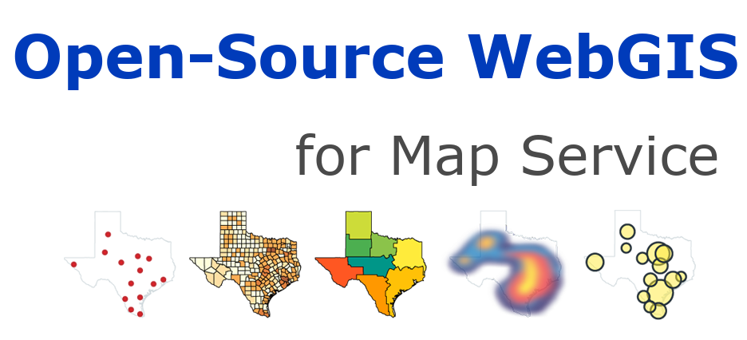

# Introduction of webgis-pub

The repository is the source codes for //webgis.pub in Sphinx project structure.
There are Python codes for some automated stuff for MapServer, 
and lots of JavaScript demos for Leaflet/OpenLayers.

The idea of this website is comes on https://demo.mapserver.org/tutorial/ 
and has undergone significant improvements.

Went through a series of refactoring.

1. Rebuild with PHP, using templates.
2. Integrated into TorCMS to serve as dynamic website.
3. Using Python to write the SSG for Mapfile processing,
   and using Jinja2 for webpage management.
4. Sphinx is introduced for the management of the pages.
   And keep the scripts for Mapfiles.

Based on MapServer, and would supply WebGIS relevant technologies.

There are a large number of historical legacy issues that need
to be addressed during the conversion process.
All the pull requests are welcome.

## How to contribute

### For tutorial contents

The source files for the tutorial are under ``webgis-src`` .
You can edit the ``.rst`` file as reStructureText.

### For WebGIS coders

Python language is mainly used for files generating and website deployment.
And some demos are written in HTML/JavaScript.

## Install and setup

Install softwares under Debian(now Debian 12):

    sudo apt install -y apache2 php8.2 libapache2-mod-fcgid cgi-mapserver \
		mapserver-bin libapache2-mod-php
    sudo a2enmod authnz_fcgi
    sudo a2enmod cgi
    sudo service apache2 restart

Setup using shell:

    sudo ln -s `pwd`/owg /owg
    mkdir /owg/ms_tmp/
    chown -R www-data.www-data /var/www/ms_tmp/

## Deploy note:

Running via Apache2. Run the following code for deployment：

    sh build.sh
