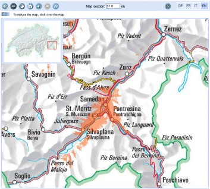

.. Author: gislite .. Title: MAP object in Mapfile

MAP Object
==========

MAP corresponds to “root” in MapFile, which contains all other objects,
and is an application-level MAP-level parameter.

Some general parameters are listed in the first part, and the detailed
parameters are explained in a later section.

General parameter description
-----------------------------

Common map settings
~~~~~~~~~~~~~~~~~~~

1. NAME: The prefix for generating Map, Scale bar and GIF legend file
   names, which should be as short as possible. Value: ``[name]`` .
2. UNITS: The unit of map coordinates. Value:
   ``[feet|inches|kilometers|meters|miles|dd]`` .
3. EXTENT: The spatial extent of the map to be created. MapServer can
   get the corresponding value at runtime, it is recommended to specify
   the corresponding value. Value: ``[minx] [miny] [maxx] [maxy]``
4. STATUS: Whether the ~map is the mark of ~active. When its value is
   OFF, the corresponding map is used as the base map or scale bar.
   Value: [on|off].
5. FONTSET: The name of the font file (including the path). Either
   absolute or relative paths can be used. Tip: Values start with a
   slash ( ``/`` ). Value: ``[path/filename.ext`` .
6. SYMBOLSET: The name of the symbol file (including the path). Either
   absolute or relative paths can be used. Tip: Values start with a
   slash ( ``/`` ). Value: ``[path/filename.ext]`` .
7. SHAPEPATH: The path of the shapefile or tile. Can be an absolute path
   or a relative path relative to the current MapFile file.

Example:

::

   # =======================================================
   # General Settings of the MapFile:
   # NAME: Name of the Map [keep short!]
   # EXTENT of the Map: minY minY maxX maxY
   # STATUS: normally on, just use for testing
   # SHAPEPATH: Path to the root dir of the data
   # =======================================================

   NAME "hangzhou"
   UNITS METERS
   EXTENT 745000 156000 758000 165000
   STATUS ON
   FONTSET d:/mapserver/sym_fonts/fonts.txt
   SYMBOLSET d:/mapserver/sym_fonts/shade.sym
   SHAPEPATH d:/gis_data/hangzhou/

General output (OUTPUT) settings
~~~~~~~~~~~~~~~~~~~~~~~~~~~~~~~~

1. IMAGETYPE: ~ output format. Its value must match the NAME value in
   the user-defined ~OUTPUTORMAT section or correspond to an internally
   supported format. Value: [gif|png|jpeg|wbmp|gtiff|swf|userdefined]
2. SIZE: :sub:`Output`\ The size of the Map, in pixels. Value: [x] [y].
3. RESOLUTION: The number of pixels per inch, its value only affects the
   scale calculation, the default value is 72. ~value: ~[integer].
4. WEB: The start tag of the WEB object, the WEB object defines how the
   WEB interface operates.
5. QUERYMAP: The start tag of the QUERYMAP object, the QUERYMAP object
   defines the display effect of the processing (MAP) query results,
   etc.

Example:

::

   # ======================================================= # General
   Output Settings of the MapFile:
   # OUTPUTFORMAT specifications
   # SIZE of the output map in pixel
   # WEB: output location definition
   # QUERYMAP: highlight color of selected objects
   # =======================================================
   IMAGETYPE PNG
   SIZE 600 518
   WEB
     IMAGEPATH "/home/gronline/mapimage/"
     IMAGEURL "/mapimage/"
   END
   QUERYMAP
     COLOR 255 0 0
     STYLE hilite
   END

Components: Datum, legend, and scale bar (Reference Map, Legend, Scale Bar)
~~~~~~~~~~~~~~~~~~~~~~~~~~~~~~~~~~~~~~~~~~~~~~~~~~~~~~~~~~~~~~~~~~~~~~~~~~~

The following components can be defined in the MapFile file:



   image0

Fig. 1 Eagle eye diagram example

1. REFERENCE: The start tag of the Reference Map object ~. ~Reference
   Map is an eagle eye map that shows the location of the map in the
   main window.
2. LEGEND: The start tag of the Legend object. ~ It defines how the
   legend is generated. A corresponding legend component is
   automatically generated for each layer in the ~CLASS pair.
3. SCALEBAR: The start tag of the Scalebar object. It defines how the
   map scale toolbar is generated.

.. figure:: image002.jpg
   :alt: image1

   image1

Scale Bar Toolbar

Example:

::

   # ================================================================
   # Components: Reference Map, Legend, Scale Bar
   # ================================================================
   # ------------------------------------
   # Reference Map Definition
   # ------------------------------------
   REFERENCE
     IMAGE images/overview_wormerl.png
     EXTENT 114052 499083 124436 505124
     STATUS ON
     COLOR -1 -1 -1
     OUTLINECOLOR 255 0 0
     SIZE 150 130
   END
   # ------------------------------------ # Legend Definition
   # ------------------------------------
   LEGEND
     STATUS embed
     POSITION ur
   END
   # ------------------------------------
   # Scale Bar Definition
   # ------------------------------------

Map definition
~~~~~~~~~~~~~~

This section includes instructions for projection in the process of
generating a map from a layer.

1. LAYER: The start identifier of the LAYER object. There should be at
   least one layer in the MapFile file, the layer is used to generate
   the map. The order in which the layers are displayed on the map is
   reversed (first layer on bottom, last layer on top); see the LAYER
   section for details.
2. PROJECTION: The start identifier of the PROJECTION object. You should
   define two types of PROJECTION objects. One is the projection of the
   output image (defined in the Map object) and the other is defined
   without the Layer. If the projections of your data are all the same,
   then you don’t need to define any projections unless you want to do a
   projection transformation.

Rarely used parameters
~~~~~~~~~~~~~~~~~~~~~~

1. CONFIG: ~ Used to configure the location of EPSG files in the ~PROJ.4
   library. Using this configuration allows PROJ.4 to use the files you
   specify. One of the advantages is that you can avoid setting the
   corresponding environment variables. For example:
   ``CONFIG PROJ_LIB /tmp/proj/`` . Setting other values will be passed
   to ``CPLSetConfigOption()`` so that you can control the behavior of
   the GDAL and OGR drivers. Please refer to the GDAL documentation for
   details. Value: ``[key] [value]``.

2. DATAPATTERN:This defines a regular expression to be applied To
   requests to change DATA parameters via URL requests (i.e.
   ``map_layername  _data=...`` )。 If a pattern doesn’t exist then web
   users Can’t monkey with support files via URLs. This allows you to
   isolate one Application from another if you desire, with the default
   operation being Very conservative. See also TEMPLATEPATTERN below.
   Value: [regular expression

3. DEBUG: Enable debugging on the MAP object. The detailed information
   of the system operation will be output to the LOG file specified by
   the WEB object. See the DEBUG section for details.

4. IMAGECOLOR: Initialize the color of the map, such as the background
   color. When transparency is enabled (TRANSPARENT ON), the specified
   color is applied to transparent areas. Values: ``[r] [g] [b]`` .

5. SACLE: Computed scale of the map. Usually used in programs rather
   than in MapFile.

6. TEMPLATEPATTERN:This defines a regular expression to be applied to
   Requests to change TEMPLATE parameters via URL requests (即
   ``map_layername_template=...`` )。 If a pattern doesn’t exist then
   web users Can’t monkey with support files via URLs. This allows you
   to isolate one Application from another if you desire, with the
   default operation being Very conservative. See also DATAPATTERN
   above. Value: ``[regular expression]``

Output format object
--------------------

Generally consider that when customizing the output format, you need to
use the IMAGETYPE keyword, OUTPUTFORMAT object. Set it only if you need
to change the default output format, and you should refer to it before
setting it:

1. The size of the image has a great influence on the performance of the
   image (the time required to generate the image and transmit the
   image). The image generated using the 256color mode is smaller than
   using the RGB mode.
2. Depending on the data, you should consider using different color
   depths. For example, if you are using satellite imagery or aerial
   imagery, you should use RGB mode to generate images. In this case the
   image produced using JPEG is much smaller than the image produced
   using PNG24.
3. When using JPEG output, you can use the QUALITY option to reduce the
   image size.
4. Use the GD or AGG image library.

GD and AGG image library
~~~~~~~~~~~~~~~~~~~~~~~~

GD is an open source library for dynamically creating images. GD can
create images in PNG, JPEG, GIF and other formats. GD raw support for
the generation of GIF images. However, since its acquisition by Unisys,
it has informally supported “Graphics Draw”.

Anti-Grain Geometry (AGG) is a high-quality 2D image rendering library
developed using C++. It has anti-aliasing and sub-pixel resolution. This
allows you to create high-quality images. The MapServer5.0 version and
its higher versions support AGG. For the same MapFile, you can use
either AGG for rendering or GD.

.. figure:: image003.jpg
   :alt: image2

   image2

Fig. 2 Image processed by AGG

Output
~~~~~~

A MapFile can define one or more OUTPUTFORMAT objects, and the supported
output formats include PNG, GIF, JPEG, GeoTiff, Flash, etc.

Support for various formats depends on the libraries used when compiling the program. GeoTiff needs the support of GDAL library
~~~~~~~~~~~~~~~~~~~~~~~~~~~~~~~~~~~~~~~~~~~~~~~~~~~~~~~~~~~~~~~~~~~~~~~~~~~~~~~~~~~~~~~~~~~~~~~~~~~~~~~~~~~~~~~~~~~~~~~~~~~~~~~

Flash (swf) requires support from the MING library.

1. NAME: The name of the output format used in IMAGETYPE in MapFile.
   Value: ``[name]``.

2. DRIVER: Generate the driver name of the output in the corresponding
   format. If the driver supports multiple formats, the definition of
   the format is fixed. For example, the driver name for GD may be
   ``GD/Gif`` , ``GD/PNG`` , ``GD/WBMP`` and ``GD/JPEG``; the driver
   name for Flasf is SWF. GDAL’s driver name is GDAL/GTiff. PNG, JPEG,
   GIF can be generated using GDAL or GD (GD is more efficient). Value:
   ``[name]``

3. IMAGEMODE: The image mode for generating the output image. Not all
   non-raster images are the same as Flash. Not all supported formats
   have all combinations. E.g. GD/GIF only supports PC256.

   1. PC256: ~ Generates a false-color image using ~256 colors
      (MapServer’s legacy mode)
   2. RGB: Renders the image in 24-bit Reb/Green/Blue mode. All colors
      are supported but transparency is not supported.
   3. RGBA: Renders the image in 24-bit Reb/Green/Blue/Alpha mode. All
      colors are supported and transparency is supported.
   4. INT16: Render single-band data with 16 as an Integer (integer) bit
      depth. Currently only valid for raster imagery and WMS layers
      using GDAL.
   5. FLOAT32: ~Renders single-band data with a Float (float) bit depth
      of ~32.  Currently only valid for raster images and WMS layers
      using GDAL. Value: [PC256/RGB/RGBA/INT16/FLOAT32]

4. MIMETYPE: the MIME type used by the data returned to the client
   through the network. Value: ``[type]`` 。

Example:

::

   MIMETYPE "application/x-shockwave-flash"
   MIMETYPE "application/x-pdf"
   MIMETYPE "image/gif"
   MIMETYPE "image/jpeg" MIMETYPE "image/png"

1. EXTENSION: generates suffixes for files of the corresponding file
   type, such as .png, .gif, etc. Value: ``[type]`` .

2. TRANSPARENT: use this parameter to indicate whether transparency is
   enabled for images in this format. Note: Transparency is not
   available when IMAGEMODE is RGB, not all formats support
   transparency. When using transparency, an 8-bit false color image is
   generated in the transparent areas, so filling other parts of the map
   with this color will also be transparent, so a suitable color should
   be used as the background color.

3. FORMATOPTION: optional parameter for driver or format. Zero or more
   FORMATOPTION can appear in the definition of an OUTPUTFORMAT.

      -GD/JPEG: the “QUALITY=n” option can be used to set the generation
      quality of JPEG images. Values range from 0 to 100. -GD/PNG:
      “INTERLACE= [ON/OFF]”, which sets whether to render the image
      interlaced. -GDAL/GIF: “INTERLACE= [ON/OFF]”, which sets whether
      to render the image interlaced. -the parameters supported by
      GDAL/GTiff:~ are as follows ~ -TILED=YES -BLOCKXSIZE=n
      -BLOCKYSIZE=n -INTERLEAVE= [PIXEL/BAND] -COMPRESS=
      [NONE,PACKBITS,JPEG,LZS,DEFAULT]

4. GDAL: all FORMATOPTION are processed using GDAL. Refer to the GDAL
   documentation for details. Value: ``[option]`` . If the defined
   OUTPUTFORMAT is not defined in the MapFile, the program will use it
   implicitly.

The following definitions:

Related to the AGG library:

::

   OUTPUTFORMAT
     NAME 'AGG_PNG'
     DRIVER AGG/PNG
     IMAGEMODE RGB
     FORMATOPTION "QUANTIZE_FORCE=ON"
     FORMATOPTION "QUANTIZE_DITHER=OFF"
     FORMATOPTION "QUANTIZE_COLORS=256"
   END

   OUTPUTFORMAT
     NAME 'AGG_JPEG'
     DRIVER AGG/JPEG
     IMAGEMODE RGB
     FORMATOPTION "QUALITY=100"
   END

Related to the GD Graphics library:

::

   OUTPUTFORMAT
     NAME **gif**
     DRIVER "GD/GIF"
     MIMETYPE "image/gif"
     IMAGEMODE PC256
     EXTENSION "gif"

   END

   OUTPUTFORMAT
     NAME **png**
     DRIVER "GD/PNG"
     MIMETYPE "image/png"
     IMAGEMODE PC256
     EXTENSION "png"
   END

   OUTPUTFORMAT
     NAME **png24**
     DRIVER "GD/PNG"
     MIMETYPE "image/png"
     IMAGEMODE RGB
     EXTENSION "png"
   END

   OUTPUTFORMAT
     NAME **jpeg**
     DRIVER "GD/JPEG"
     MIMETYPE "image/jpeg"
     IMAGEMODE RGB
     EXTENSION "jpg"
   END

   OUTPUTFORMAT
     NAME **wbmp**
     DRIVER "GD/WBMP"
     MIMETYPE "image/wbmp"
     IMAGEMODE PC256
     EXTENSION "wbmp"
   END

   OUTPUTFORMAT
     NAME **swf**
     DRIVER "SWF"
     MIMETYPE "application/x-shockwave-flash"
     EXTENSION "swf"   IMAGEMODE PC256
     FORMATOPTION "OUTPUT\_MOVIE=SINGLE"
   END

   OUTPUTFORMAT
     NAME **GTiff**
     DRIVER "GDAL/GTiff"
     MIMETYPE "image/tiff"
     IMAGEMODE RGB
     EXTENSION "tif"
   END

WEB Object
----------

Defines a parameter for the WEB interface runtime. To ``WEB`` Start with
``END`` End.

1.  IMAGEPATH: The temporary directory where temporary images are
    stored. It must be available when the WEB server is running. It must
    start with a slash ``/``. Value: ``[path``

2.  IMAGEURL: Virtual path to access temporary images stored under
    IMAGEPATH. Value: ``[url|virtual directory]``

3.  EMPTY: The URL to redirect to when the query fails. If no value is
    defined, it will redirect to the URL defined by ~ERROR. Value:
    ``[url]``

4.  ERROR: The URL to which the error occurred. If not defined,
    MapServer’s error message will be output. Value: ``[url]``

5.  LOG: The file that stores the system log, which must be available
    when the WEB server is running. Value: ``[filename]``

6.  MINSASLE: Minimum scaling. An image of this scale will be returned
    when the value requested by the user is less than this value. Value:
    ``[double]`` .

7.  MINTEMPLATE: The template used above the minimum scale, which is
    useful for nested applications. (Template to be used if above the
    minimum scale for the app, useful for nesting apps) Value:
    ``[file|url]``

8.  MAXSCALE: The maximum zoom ratio. An image at this scale will be
    returned when the user requests a value greater than this value.
    Value: ``[double]`` .

9.  MAXTEMPLATE: The template used when the maximum scale is above,
    which is useful for nested applications. (Template to be used if
    above the maximum scale for the app, useful for nesting apps.)
    Value: ``[file|url``] .

10. TEMPLATE: The template file or URL used to represent the results in
    interactive mode. Value: ``[file|url]`` .

11. HEADER: The template file first sent to the client. Only used in
    multi-result query mode. (Template to use before everything else has
    been sent. Multiresult query modes only). Value: ``[filename]``

12. FOOTER: The template file that is finally sent to the client. Only
    used in multi-result query mode. (Template to use before everything
    else has been sent. Multiresult query modes only). Value:
    ``[filename]``

13. METADATA: Use this identifier to store arbitrary key-value pairs.
    Often used when configuring OGC WMS. It is also very flexible when
    creating templates, and any content entered here can be obtained
    through template transitions. example:

    METADATA title “Map of China” autor “YanMing” END

Example:

::

   WEB
       IMAGEPATH "f:/mapserver/mapimages/"
       IMAGEURL "/mapimages/"
       ERROR http://www.mapserver.ch/mapserver/ms_error.htm
       EMPTY http://www.mapserver.ch/mapserver/ms_empty.htm
       LOG f:/mapserver/logs/mapserver.log
   END

QUERYMAP Object
---------------

Define how query results are rendered

1. COLOR: The color of feature highlighting, the default is yellow.
   Value: ``[r] [g] [b]``

2. SIZE: The size of the map, in pixels. The default is the size defined
   in the MAP object. Value: ``[x][y]``

3. STATUS: Whether to display the map obtained from the query.

4. STYLE: Set the realistic way of querying the obtained map. Maps or
   map parts that are not selected are not processed.

   -  Normal: Render the layer in the style of the original layer.
   -  Hilite: Renders the selected layer using the value of COLOR.
   -  Selected: Show only selected layers

Value: ``[normal|hilite|selected]``

Example:

::

   QUERYMAP
   COLOR 255 0 0
   STYLE hilite
   END

REFERENCE Object reference map
------------------------------

It is a preview showing the location of the map in the main window.

Begins with a REFERENCE and ends with an END. Three types of reference
maps are supported. The most common is to show the extent of the map
being interacted with in the preview. It is also possible to include a
reference map as part of a query. Point query will generate an icon (an
image with a marker) on the query point; face query will highlight the
queried area; query given to feature will display the selected part.

1.  IMAGE: The name of the reference map image (including the path),
    which can be an absolute or relative path. Value:
    [path/filename.ext]
2.  SIZE: The pixel size of the reference map image
3.  EXTENT: ~The spatial extent of the image. Value: ~[minx] [miny]
    [maxx] [maxy]
4.  STATUS: ~Whether to create a ~reference map, the default is OFF.
    Value: [on \| off]
5.  COLOR: The fill color of the corresponding BOX range, the default is
    red. A value of -1 is transparent. Value: [r] [g] [b]
6.  OUTLINECOLOR: ~ corresponds to the color of the border of ~BOX, the
    default is black, when the value is -1, there is no border. ~value:
    ~[r] [g] [b]
7.  MARKER: The mark displayed when the corresponding range becomes very
    small (obtained from the symbol file), the default is the cross
    mark. ~value: ~[integer \| string]
8.  MARKERSIZE: ~ defines the size of the symbol that replaces ~BOX.
    Value: [integer]
9.  MINBOXSIZE: ~ When ~BOX is smaller than MINBOXSIZE, use MARKER and
    MARKERSIZE to display. ~value: ~[integer]
10. MAXBOXSIZE: When the BOX is larger than MINBOXSIZE, nothing is
    rendered. Value: [integer]

Example:

::

   # ------------------------------------
   # Reference Map Definition
   # ------------------------------------
   REFERENCE
     IMAGE images/overview\_wormerl.png
     EXTENT 114052 499083 124436 505124
     STATUS ON
     COLOR -1 -1 -1
     OUTLINECOLOR 255 0 0
     SIZE 150 130
   END

LEGEND Object In MapServer, there are three ways to create legends.
-------------------------------------------------------------------

1. Simple Image Legends: generate legends just like using a desktop
   graphics system. This approach is very simple, but it has great
   limitations.
2. Legends using HTML templates:~ is a complex way to automatically
   create legends using ~ MapServer.
3. Plain HTML legends:~ manually compiles the legend ~ HTML file. This
   method is very free, but it needs the corresponding HTML file, and it
   is troublesome to update it.

Simple Image Legends
~~~~~~~~~~~~~~~~~~~~~~~

Define the mode of production of the legend file, and the CLASS object
creates the corresponding legend component for each individual
highlight. Start with LEGEND and end with END. The size of the legend
image is not unknown before it is created, so do not use the ````
The width and height of the hard-coded image in the tag.

1. IMAGECOLOR: ~ The initial color of the legend (eg background color).
   Value: ~[r] [g] [b].
2. LABEL: The start identifier of the LABEL object.
3. OUTLINECOLOR: The color of the symbol border. Value: [r] [g] [b]
4. POSITION: ~ The location of the legend on the map. Defaults to ~lr.
   Value: [ul|uc|ur|ll|lc|lr]
5. KEYSIZE: The legend box in pixels, the default is 20 X 10. Value: [x]
   [y]
6. KEYSPACING: The space between the ~ symbols, the default is ~5 X 5.
   Value: [x] [y]
7. POSTLABELCACHE: ~tells ~MapServer to render the legend after all
   labels are rendered. Useful when adding homogeneous elements.
   Defaults to false. Value: [true|false]
8. STATUS: Whether to create this legend. Value: on|off|embed]

Example 1:

::

   # ------------------------------------
   # Legend Definition
   # ------------------------------------
   LEGEND
       STATUS embed
       POSITION ur
   END

This legend is automatically created for all layers, the legend contains
the layer name.

Example 2:

::

   LAYER
    NAME "Restaurants"
    STATUS ON
    TYPE POINT
    DATA "restaurants.shp"
     CLASS
      NAME "Restaurants"
      COLOR 255 127 127
      SIZE 14
      SYMBOL "restaurants"
    END
   END

This legend will create a legend with the “restaurants” symbol and
restaurants text.

As shown below:

.. figure:: image004.jpg
   :alt: image3

   image3

Legends using Templates
~~~~~~~~~~~~~~~~~~~~~~~

MapServer version 3.5 and above can use template files to generate
legends. In MapFile The TEMPLATE parameter is used in the file to enable
template-based legend generation. Set up TEMPLATE file, the file will
replace main HTML The content referred to by the [legend] tag in the
file. Template files must have an. Html extension.

HTML Legend template File
~~~~~~~~~~~~~~~~~~~~~~~~~

The HTML legend template file contains 0 or one of the following tags,
and the program will use the corresponding tags

Generate the legend:

::

   \[leg\_group\_html\] ... \[/leg\_group\_html\]
   \[leg\_layer\_html &lt;OPTIONAL PARAMS&gt;\] ... \[/leg\_layer\_html\]
   \[leg\_class\_html &lt;OPTIONAL PARAMS&gt;\] ... \[/leg\_class\_html\]

Anything in the legend file except the label pair above will be ignored

1) GROUP block tag: [leg_group_html]…[leg_group_html]

The HTML block that uses this tag in a group of layers is that the
layers will appear in the legend. When using the ``[leg_group_html]``
tag, styles for layers that do not belong to any group (LAYER GROUP not
set in the MapFile) are also not displayed in the legend. The list of
groups is determined by ``order_metadata``, which is explained later….

Tags that can appear in [leg_group_html] blocks:

-  ``[leg_group_name]`` Name of the group
-  ``[layer_status]`` The state of the first layer in the group
-  ``[leg\_icon width=&lt;optional\_width&gt; height=&lt;optional\_height&gt;\]``
   The icon of the legend, [leg_icon] is the URL of the icon.
-  ``metadata name=&lt;metadata_field_to_display&gt;]`` Returns the
   specified metadata

Example: show layer group

[leg_group_html]

<tr><td colspan=2><b>[leg_group_name]</b></td></tr>

[leg_group_html]

2) LAYER block tag: [leg_layer_html <OPTIONAL PARAMS>] …
   [/leg_layer_html]When this ~ tag is not set, no ~layer header will be
   displayed.

The optional parameters are as follows:

l order_metadata = <field_to_order_by> You can use the value of
<field_to_order_by> to control the display order and visibility of
layers in the legend.

When the value of <field_to_order_by> is greater than zero, sort by this
value.

If the value of <field_to_order_by> of two layers is the same, then the
order of MAP LAYER is used.

<field_to_order_by> will not be displayed in the legend if the value is
less than zero.

l opt_flag = <bit_mask> Controls the display process of the layer. The
values are as follows:

::

    1. : Legend is still shown when out of Scale (default is out of Scale, no legend is shown)
    2. : The corresponding legend is still displayed when the layer status is OFF (by default, the corresponding legend is not displayed when STATUS is OFF).
    4. : The legend is still displayed when the layer type is QUERY (the default is not displayed when the TYPE is QUERY)
    8. : The legend is still displayed when the ~layer type is ~ANNOTATION (the legend is not displayed when the TYPE is ANNOTATION by default) Example: opt\_flag=12 means to display all ~layer types, including ~QUERY and ANNOTATION.(4 +8)

The tags that can appear in the [leg_layer_html] block are as follows:~

a) [leg_layer_name] returns the value of the layer name

b) [leg_icon width=<option_width> height=<option_height>] returns the
   URL of the legend icon

c) [metadata name=<metadata_field_to_display>] Returns the specified
   metadata value and WEB metadata Example: Display layer title with
   href link

[leg_layer_html order_metadata=WMS_ORDER visibility_flag=15]

<a href=“[leg_layer_name]”>[metadata name=WMS_TITLE]</a><BR>
[/leg_layer_html]

3) CLASS block tag:[leg \_ class \_ html & lt;OPTIONAL PARAMS>] .[/
   leg \_ class \_ html]

If not set, no style will be displayed.

CLASS whose NAME is NULL will not be displayed

Optional parameters:

l opt_flag = <bit_mask> controls the display of layers. The values are
as follows:

::

    - 1 : Legend is still shown when out of Scale (default is out of Scale, no legend is shown)
    - 2 : The corresponding legend is still displayed when the layer status is OFF (by default, the corresponding legend is not displayed when STATUS is OFF).
    - 4 : The legend is still displayed when the layer type is QUERY (by default it is not displayed when the TYPE is QUERY)
    - 8 : The legend is still displayed when the layer type is ANNOTATION (by default, the legend is not displayed when the TYPE is ANNOTATION)

Example: ``opt_flag=12`` means to show all layer types, including QUERY
and ANNOTATION. (4x8)

Tags that can be used under [leg_class_html]:

[leg_class_name] Value of CLASS NAME

[leg_class_title] Value of CLASS TITLE

[leg_icon width=<option_width> height=<option_height>] Returns the URL
of the legend icon

[metadata name=<metadata_field_to_display>] Returns the specified
metadata value

and WEB metadata :sub:`data`

Example:

::

             \[leg\_class\_html opt\_flag=15\]

 [leg_class_name]<br>

[/leg_class_html]

4) CONDITIONAL text

Label:

[if name=<field_to_check> oper=<eq|neq|isset|isnull>

value=<to_compare_with_field>]

…

[/if] The [if] tag can be inside the [leg_*_html] tag, and nesting is
recommended. The value of the parameter oper can be eq (equal), neq (not
equal), isset, isnull. Defaults to equal.

2.6.3 Plain HTML legends
~~~~~~~~~~~~~~~~~~~~~~~~

This is another way to create a legend. Pre-processed, use HTML, PHTML,
PHP, etc.

Example:

.. figure:: image005.jpg
   :alt: image4

   image4

SCALEBAR Object
---------------

SCALEBAR defines the mode of production of map scales. Start with
SCALEBAR and end with END. The size of the legend image is not unknown
before creation, so do not hard-code the width and height of the image
in the & lt;img> tag of the template file.

Note: fonts of TrueType type are currently not available.

1.  How many parts of the INTERVALS:~ legend bar are divided? the
    default is ~ 4. Value:[integer]
2.  UNITS: the unit of output scale bar. The default is meters. The real
    map can be obtained by using the map unit as its unit. Value: ~[feet
    \| inches \| kilometers \| meters \| miles]
3.  COLOR: renders the layer using the color specified by COLOR when not
    using the property sheet. Value:[r] [g] [b]
4.  IMAGECOLOR: initializes the color of the scale bar. Value:[r] [g]
    [b]
5.  BACKGROUNDCOLOR: background color. Value:[r] [g] [b]
6.  OUTLINECOLOR: the color of the border (border). The default value
    of-1 indicates an unbounded color. ~ value:[r] [g] [b]
7.  LABEL: note the size of the SIZE. Note: TrueType-type postures
    cannot be used. ~ use ~[tiny \| small \| medium \| large \| giant]
    to define the value of SIZE. ~ usually you should use ~ tiny or
    small.
8.  POSITION：~The position where the scale bar is placed, the default
    is ~lr.：[ul|uc|ur|ll|lc|lr]。
9.  SIZE: the size of the scale bar. Value:[tiny \| small \| medium \|
    large \| giant].
10. STYLE: the type of scale bar. Value:[0 \| 1]
11. POSTLABELCACHE:~ tells ~ MapServer to render the legend after all
    the labels have been rendered. It is useful when adding elements of
    the same kind. The default is false. Value:[true \| false].
12. STATUS: whether to create a scale bar image and whether to embed the
    image. Note: you need to define a MARKERSET to embed the scale bar.
    In effect, the legend bar then becomes a :sub:`custom`\ mark
    identical to the other annotations. ~Value: ~[on \| off \| embed].
13. TRANSPARENT: whether the background of the legend bar is
    transparent, the default is OFF. Value:[on \| off].

Example 1:

::

   # ------------------------------------
   # Scale Bar Definition - STYLE 0
   # ------------------------------------
   SCALEBAR
   INTERVALS 5
   UNITS kilometers
   OUTLINECOLOR 0 0 0
   STYLE 0
   STATUS embed
     LABEL
       SIZE small
       COLOR 0 0 0
     END
   END

The illustration bar is as follows:

.. figure:: image006.jpg
   :alt: image5

   image5

Example 2:

::

   # ------------------------------------
   # Scale Bar Definition - STYLE 1
   # ------------------------------------
   SCALEBAR
   INTERVALS 5
   UNITS meters
   STYLE 1
   STATUS embed
     LABEL
       SIZE small
       COLOR 0 0 0
     END
   END

The illustration bar is as follows:

.. figure:: image002.jpg
   :alt: image6

   image6
