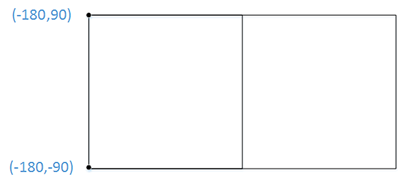
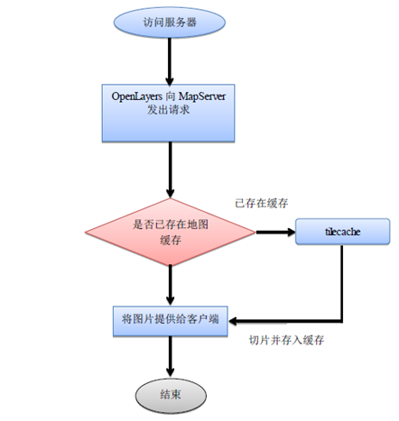

.. Author: gislite .. Title: Principle of map slicing

Principle of map tiles
======================

What is tile? A tile is a collection of pictures in a grid that are
similar to tiles. Tile data is a cache image set formed by
pre-processing vector or image data and using efficient caching
mechanisms (such as pyramids). It is organized in a “level, row, column”
way, and can be quickly loaded in the web page. Therefore, tile map
loading is to obtain the tiles of the grid under the corresponding level
(i.e. the image pre cut by the server) by calculating the row and column
number according to the map range and level requested by the client, and
these tiles are collected to form a map at the client, as shown in
Figure 2.21.

Vector map and tile map have their own characteristics and advantages,
and they can be applied in combination. The real-time generation of
vector map can edit, query and analyze the map data online. it has
spatial relationship and can support network analysis, spatial analysis
and other applications. Because the tile map is a pre-cut cache picture
collection, the network loading speed is fast and the effect is good, so
it is often used as the base map.

Map slicing: the process in which the pre-generated method is stored on
the server, and then the corresponding map tiles are sent to the client
according to different requests submitted by the user. It is a
multi-resolution hierarchical model, from the bottom of the tile pyramid
to the top, the resolution is getting lower and lower, but the
geographical range remains the same.

Map cache: Also known as map tiles, it is a directory containing map
tiles of the entire map range at different scales, that is, a cached map
service is a service that can use static images to quickly provide maps.

Here is an introduction to several important concepts in map slices.

Principle
---------

Several concepts:

In map slicing, there are three important concepts: 1. slice origin; 2.
slice resolution (scale); 3. initial slice range. The following is a
brief introduction to these three concepts.

   Map slicing schematic diagram

1.Slice origin

There are generally two types of slice origins: 1. the upper left
corner; 2. the lower left corner. Most of the slicing algorithms use the
upper left corner as the origin of the slice, such as Sky Map, ArcGIS
Server, and so on. The slice origin defines the location of my first
256*256 slice.

2.Slice resolution (scale)

The slice resolution and scale correspond one to one. Scale refers to
the actual distance represented by a unit on my map. The resolution
represents the actual distance represented by one pixel on the screen,
so when one is determined, the corresponding one is also determined.

The slice resolution (scale) affects the actual coordinates of one of my
256-256 images at that resolution (scale).

3.Initialize the range of slices

The initial slice range refers to the size of the image I sliced, and
the image is how many 256*256 slices I can slice at this resolution.

Map tiles technique
-------------------

After understanding the principle of map slicing, we will find that as
long as the relevant parameters (origin, resolution) are passed to the
map server, through the ``GetMap`` You can get the slice. Of course, in
the specific technical implementation, we still have to do some
calculation, traversal and other operations.

To get a slice, you can see the previous section. ``GetMap`` The example
illustrated in.

Map tiles software tool
-----------------------

After the emergence of the concept of map slicing, many software tools
for map slicing have been developed. On the one hand, the original GIS
software added the function of map slicing; on the other hand, some
independent map slicing tools have been developed.

On the Python side, TileCache was used earlier, but the last version of
this tool ( tilecache-2.11 ) was released in October 2010 and has since
been discontinued. TileCache is an implementation of a WMS-C (about)
compliant service released by Metacarta under the BSD license. (and
TileCacheConfig) TileCache originated from a resolution at the FOSS4G
2006 conference, which was a later OGC recommendation, the WMS Tiling
Client Recommendation. The so-called TileCache is because the ordinary
WMS server needs to read data and generate pictures after receiving the
request, and the efficiency is too low. Then for those immutable map
services, you can encapsulate a TMS (Tiled Map Service) in the front end
of WMS. TileCache first caches some WMS map images, provides a pseudo
WMS, and only interacts with the background WMS server when appropriate.
The implementation of this standard is provided by MetaCarta, the
backend of OpenLayers, called TileCache. TileCache is implemented in
Python and can be deployed and run on Apache and IIS as well as Python’s
WSGI via cgi.

.. raw:: html

   <!-- https://blog.csdn.net/yinianshen/article/details/3300674 -->

.. raw:: html

   <!--
   TileCache provides a Python-based WMS-C/TMS server
   With pluggable caching mechanisms and rendering backends.
   In the simplest use case, TileCache requires only write access to a disk
   The ability to run Python CGI scripts, and a WMS you want to be cached.
   With these resources, you can create your own local disk-based cache of any WMS server
   And use the result in any WMS-C supporting client, like OpenLayers
   Or any TMS supporting client, like OpenLayers and worldKit.
   -->

TileCache provides a Python-based WMS-C/TMS service with a pluggable
caching mechanism and rendering backend. In the simplest use case,
TileCache only needs write access to the disk, the ability to run Python
CGI scripts, and the WMS to cache. With these resources, you can create
your own local disk-based cache for any WMS server And use this result
in any client that supports WMS-C, such as OpenLayers, or any client
that supports TMS, such as OpenLayers and WorldKit.

MapProxy is another map slicing tool developed in Python language after
TileCache. Its degree of perfection is much greater than TileCache, and
the current development is still very active.

Tools for maps tiles
--------------------

When the user browses the system map, MapServer parses, draws and cuts
the image according to the MapFile file in real time and returns the
image to the client. The response time is acceptable when there is a
small amount of local data, but when the amount of local data is large
and accessed by a large number of users, the response time will be
unbearable. This topic will use the open source tilecache technology to
realize the map tile cache, and use the cache mechanism to improve the
response efficiency of the system.

The idea of map tile comes from the hierarchical detail model, which can
cut the whole image into a large number of small images with the same
resolution. When users view the image, generally only a small number of
tiles are operated at a time, and the server can send the corresponding
tiles to meet the needs of users. In this way, while reducing the amount
of network data and reducing the bandwidth, the use of Ajax technology
to make tiles download asynchronously on the server can greatly reduce
the system response time and improve the user experience.

The map tiles are organized and stored in groups according to proportion
by pyramid structure (quadtree). For each increase in the browsing
level, four images with higher resolution are used instead of one with
lower resolution.

Each tile in the pyramid model is given a unique ID number. Using the
numbered index, combined with the resolution required by the user to
operate the map, we can determine which numbered tile is needed.

tilecache is a map tile buffer developed by MetaCarta Labs, which is
used to cache maps. Only when the requested map is not in the tilecache
buffer file, will it interact with the service to request the map (Li
Zhenhua, Liu Peng, Wang Zhen, & Gao Chengxia, 2009), with OpenLayers to
make map display faster. Tilecache supports multiple OGC service
standards and multiple servers, and supports multiple request formats
and methods.

   Tilecache caching mechanism

Tilecache caching mechanism

MapCache is a server that implements tiled caching to speed up access to
the WMS tier. The main goal is to be fast and easy to deploy, while
providing basic functionality (and more! Map slice caching solution

MapProxy is a map slicing tool developed by Python. It is easy to use
and stable in production environment.
